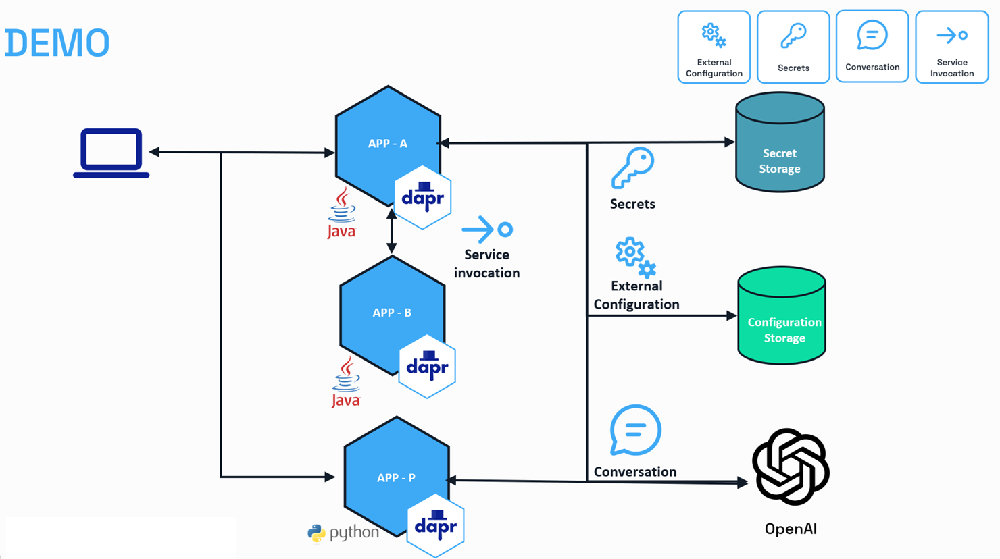
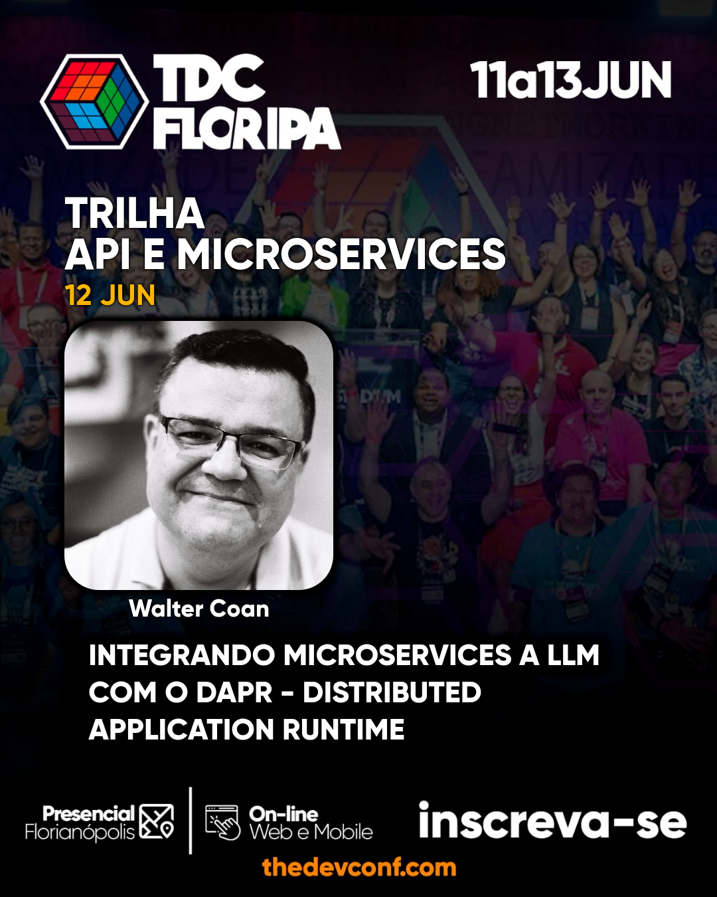

# TDC Florianópolis 2025 - Integrando Microservices a LLM com o Dapr 🎩- Distributed Application Runtime

[](https://skillicons.dev)

## Arquitetura



## Evento



[Download Slides](./diagramas/waltercoan-Integrando%20Microservices%20a%20LLM%20com%20o%20Dapr.pdf)

## Ambiente

- Criar um GitHub CodeSpace a partir de um fork da branch main
- criar um arquivo .env na raiz do projeto com as seguintes variáveis

```bash
openapikey=<CHAVE DA OPENAI>
DAPR_CONFIGURATION_STORE=configstore
AWS_ACCESS_KEY_ID=<AWS ACCESS KEY COM PERMISSAO PARA O BEDROCK>
AWS_SECRET_ACCESS_KEY=<AWS SECRET ACCESS KEY COM PERMISSAO PARA O BEDROCK>
AWS_DEFAULT_REGION=sa-east-1
```

- Teclar F5 para executar o arquivo .vscode/launch.json

- Utilizar o [arquivo teste.rest](./teste.rest) para executar as chamadas

## Instalação do Dapr

- No terminal digitar

```bash
dapr init
```
- Compilação dos projetos Java

```bash
mvn package -DskipTests
```

- Criação do Python Enviroment 

```bash
pip install -r requirements.txt -t .
pip install fastapi[standard]
apt-get install python3-venv
python3 -m venv venv
source ./venv/bin/activate
```
- Inclusão da chave-valor de configuração no Redis

```bash
docker exec dapr_redis redis-cli MSET CONVERSATION-NAME "openai-gpt"
```